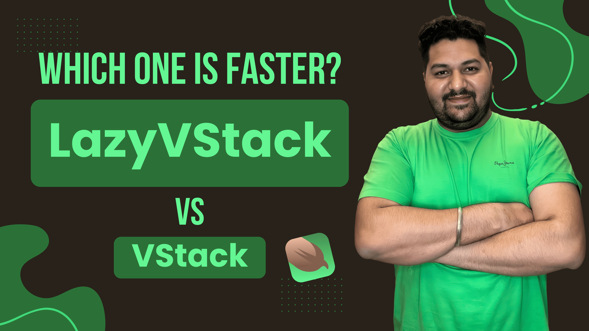

# SwiftUI LazyVStack vs VStack – Performance Explained with Real Example

[](https://youtu.be/VJ4ULHsS6vE)

🚀 **Video Title**: LazyVStack vs VStack in SwiftUI | SwiftUI Performance Tips | SwiftUI Interview Questions  
🎥 **Watch Now**: [YouTube Video](https://youtu.be/VJ4ULHsS6vE)  
📂 **Playlist**: [SwiftUI Master Series](https://www.youtube.com/playlist?list=PL2Sk-NhO3icG_QURMdvp-1Ap_w5ya0L8m)

---

## 📌 About This Video

This video explains the **difference between VStack and LazyVStack in SwiftUI**, focusing on their performance, rendering behavior, and practical use cases. Whether you're a beginner or preparing for iOS interviews, understanding this concept is key.

💡 We cover:
- What is VStack in SwiftUI
- What is LazyVStack and when to use it
- Practical UI example and comparison
- Real-world scenarios for optimization
- SwiftUI rendering and memory usage insight

---

## ✅ Use Cases Covered

- Long list of views or dynamic data
- iOS apps with scrolling performance issues
- Interview scenarios: "When to use LazyVStack?"
- iOS 16+ and backward compatibility

---

## 👨‍💻 Technologies & Tools Used

- SwiftUI
- Xcode 15+
- iOS 16 and earlier compatibility
- macOS for testing
- GitHub (for code sharing)

---

## 🔗 Related Videos
📺 Explore Full Playlist: [SwiftUI Tutorials](https://www.youtube.com/playlist?list=PL2Sk-NhO3icG_QURMdvp-1Ap_w5ya0L8m)

---

## 🧠 Interview Prep Tip

> "LazyVStack is your best friend when performance matters in SwiftUI."

Understanding the **lifecycle and rendering strategy** of layout stacks in SwiftUI helps you write cleaner and more efficient code — and impress interviewers!

---

## 🧵 Follow & Connect

- 👨‍💻 Created by: [Pushpendra Kumar](https://www.linkedin.com/in/pushpendra-saini/)
- 💬 DM for iOS App Development & SwiftUI Projects
- 📞 Book a Consultation: [https://topmate.io/pushpendra_saini](https://topmate.io/pushpendra_saini)

---

## 📈 Tags (for SEO & Discovery)

```

swiftui, lazyvstack, vstack, swiftui performance, swiftui tutorial, swiftui lazyvstack vs vstack, ios interview question, swiftui list, lazy loading swiftui, xcode swiftui, apple developer swiftui, swiftui optimization, ios developer tips

```

---

## 📢 Don't Forget

If you found this helpful:
- ⭐ Star this repo
- 💬 Comment on the video
- ♻️ Share with your iOS dev friends
- 🔔 Subscribe to the channel for more

```

"Write less code, but think more." – Steve Jobs (in spirit)

```
